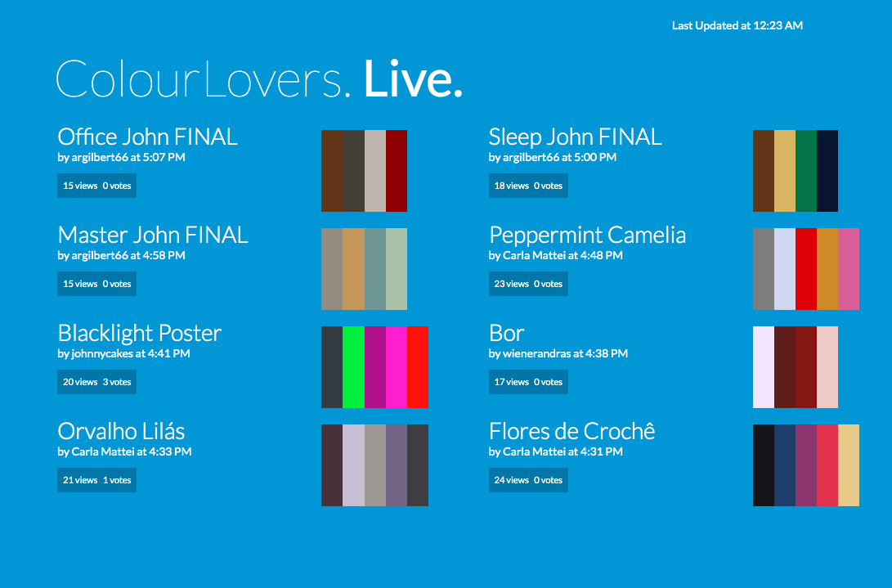

## Running The Project on Local Repo

1) After cloning the repository, navigate into the main directory an run npm install

2) Once all the dependencies are downloaded, run the command npm run start  

###  Recommended Chrome Plugin for CORS Control

While in development environment, one of the easier way to get around CORS errors is to install the plugin below and opt to turn off CORS while in dev mode.

https://chrome.google.com/webstore/detail/allow-cors-access-control/lhobafahddgcelffkeicbaginigeejlf/related?hl=en

Another way of going around the CORS error is by using $.getJSON

##  Screenshots of ColourLovers Project

